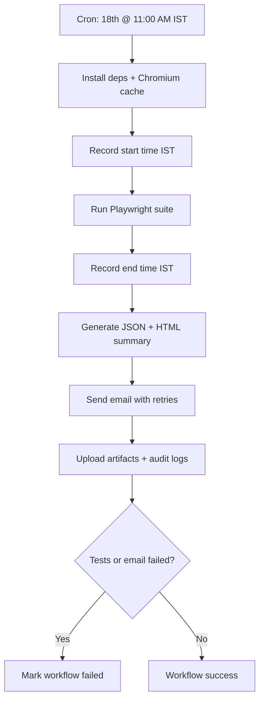

# Monthly Automation Scheduler

Automated GSTR-3B test execution on the **18th of every month at 11:00 AM IST**, with report generation, audit logs, and management email delivery.

## Scheduler Configuration

| Setting | Value |
|---------|-------|
| Workflow file | `.github/workflows/monthly-automation.yml` |
| Schedule (UTC) | `30 5 18 * *` |
| Schedule (IST) | 18th of every month, 11:00 AM |
| Timezone | `Asia/Kolkata` (set via `TZ` env) |
| Browser | Chromium only |
| Manual trigger | GitHub Actions → **Monthly Automation Scheduler** → **Run workflow** |

## Automation Execution Flow



1. Checkout code and restore cached Chromium browser.
2. Run the full Playwright suite (`--project=chromium`).
3. Parse JSON results and build an executive summary report.
4. Email management with counts, failed scenarios, and HTML attachments.
5. Store logs and reports as GitHub artifacts (2-day retention).

## Report Generation Logic

| Output | Location |
|--------|----------|
| Playwright JSON results | `reports/playwright-results.json` |
| Executive summary JSON | `execution-logs/<timestamp>/execution-summary.json` |
| Executive summary HTML | `execution-logs/<timestamp>/execution-summary.html` |
| Audit trail | `execution-logs/<timestamp>/execution-audit.log` |
| Console output | `execution-logs/playwright-console.log` |
| Scheduler log | `execution-logs/scheduler.log` |

Report includes: total/passed/failed/skipped counts, start/end time, duration, environment details, failed test errors, and workflow run link.

Scripts:

- `node scripts/generate-execution-report.js`
- `node scripts/send-report-email.js`

## Email Integration

Email uses SMTP via `nodemailer` with **3 retries** (5s, 15s, 30s backoff).

**Subject:** `Monthly Automation Execution Report – <Month YYYY>`

**Attachments:**

- `execution-summary.html`
- `playwright-report-index.html` (when available)

### Required GitHub Secrets

| Secret | Description |
|--------|-------------|
| `GSTHERO_EMAIL` | GSTHero login email |
| `GSTHERO_PASSWORD` | GSTHero login password |
| `SMTP_HOST` | SMTP server host (e.g. `smtp.gmail.com`) |
| `SMTP_PORT` | SMTP port (usually `587`) |
| `SMTP_USER` | SMTP username |
| `SMTP_PASSWORD` | SMTP password or app password |
### Optional GitHub Secrets

| Secret | Description |
|--------|-------------|
| `GSTHERO_GSTIN` | GSTIN override |
| `GSTHERO_RETURN_MONTH` | Fixed return month |
| `SMTP_FROM` | From address (defaults to `SMTP_USER`) |
| `REPORT_EMAIL_TO` | Override default recipient `vishal.ghaste@gsthero.com` |

## Deployment Steps

1. **Push workflow and scripts** to the `main` branch on GitHub.
2. **Add GitHub Secrets** under *Settings → Secrets and variables → Actions*.
3. **Enable GitHub Actions** for the repository (Settings → Actions → General).
4. **Verify SMTP** credentials (Gmail/Office365/SendGrid SMTP).
5. **Run a manual test:**
   - Go to **Actions → Monthly Automation Scheduler → Run workflow**.
6. **Confirm delivery:**
   - Check management inbox for the report email.
   - Download the `monthly-automation-<run-id>` artifact for audit logs.
7. **Monitor the first scheduled run** on the 18th at 11:00 AM IST.

## Local Testing (optional)

```bash
npm ci
npx playwright install chromium

# Run tests with report output
set GENERATE_EXECUTION_REPORT=true   # Windows CMD
# export GENERATE_EXECUTION_REPORT=true   # Linux/macOS
npm test

node scripts/generate-execution-report.js
```

To test email locally, add SMTP variables to `.env` and run:

```bash
node scripts/send-report-email.js
```
